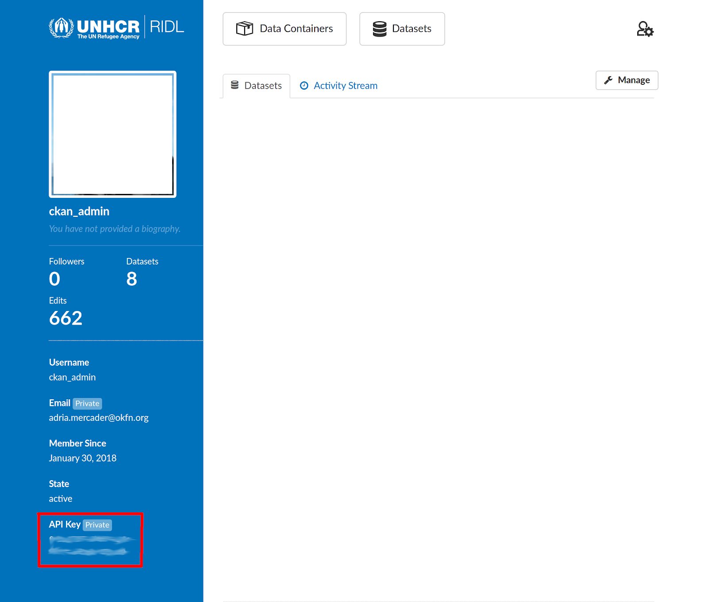

<!-- README.md is generated from README.Rmd. Please edit that file -->

# ridl 

[](http://www.repostatus.org/#wip)
[](https://gitlab.com/dickoa/ridl/pipelines)
[](https://codecov.io/gh/dickoa/ridl)
[](https://cran.r-project.org/package=ridl)
[](https://opensource.org/licenses/MIT)

`ridl` is an R client for the [UNHCR Raw Internal Data Library (RIDL)
platform](https://ridl.unhcr.org).

### Introduction

The [UNHCR RIDL platform](https://ridl.unhcr.org) is UNHCR internal
platform to easily store, find and analyze raw data.

#### RIDL concepts

In order to easily use the `ridl` package, it’s important to understand
some key concepts of this platform. RIDL documentation is available
[here](https://im.unhcr.org/ridl) for more details.

##### `Container`

A `container` is a placeholder where we can share data on `RIDL`. A
`container` is represented in the `ridl` package as a `RIDLContainer`
object and can hold zero or multiple `datasets`.

##### `Dataset`

A `dataset` is a placeholder where we can share data files
(`resources`). In a dataset page there’s some metadata that give you
enough context and information to properly store the data files and use
them. A data file e.g an Excel file is called a `resource` and many of
them can be shared in `dataset` page. In the `ridl` package, a
`RIDLDataset` object is used to represent a `dataset`.

##### `Resource`

A `resource` is a file shared in `dataset` page, it includes `microdata`
and supporting documents like reports or survey forms. A `RIDLResource`
class is used to implement all the logic needed to manipulate RIDL
`resource`.

### Installation

This package is not on yet on CRAN and to install it, you will need the
[`remotes`](https://github.com/r-lib/remotes) package. You can get
`ridl` from Gitlab or Github (mirror)

``` r
## install.packages("remotes")
remotes::install_gitlab("dickoa/ridl")
```

### ridl: A quick tutorial

``` r
library("ridl")
```

The `ridl` package requires you to add your API key and store it for
further use. The easiest way to do that is to store your API key in your
`.Renviron` file which is automatically read by R on startup.

You can retrieve your `API key` in your [user
page](https://ridl.unhcr.org/user/).



You can either edit directly the `.Renviron` file or access it by
calling `usethis::edit_r_environ()` (assuming you have the `usethis`
package installed) and entering:

``` bash
RIDL_API_KEY=xxxxxxxxxxxxxxxxxx
```

Once the environment variable is set you will need to restart your
session.

``` r
library("ridl")
get_ridl_config()
## <RIDL Configuration>
##   RIDL site url: https://ridl.unhcr.org
##   RIDL API key: xxxxxxxxxxxxxxxxxx
```

You can also configure directly the `ridl` package using the
`set_ridl_config` function and check the config using `get_ridl_config`
but it’s not persistent if you close your session.

``` r
set_ridl_config(ridl_key = "xxxxxxxxxxxxxxxxxx")
get_ridl_config()
## <RIDL Configuration>
##   RIDL site url: https://ridl.unhcr.org
##   RIDL API key: xxxxxxxxxxxxxxxxxx
```

Now that we are connected to RIDL, we can search for dataset using
`search_datasets`.

``` r
search_ridl_dataset("mali", visibility = "public", rows = 2) ## search internally public dataset in RIDL, limit the results to two rows
## [[1]]
## <RIDL Dataset> 6f37029d-0ec2-4322-88ed-6447b2eebf3a
##   Title: Socio-economic assessment of Malian refugees in Burkina Faso 2016
##   Name: unhcr-bfa-2016-sea-1-1
##   Visibility: public
##   Resources (up to 5): DDI XML, DDI RDF, UNHCR_BFA_2016_SEA_household_v1_1, UNHCR_BFA_2016_SEA_individual_v1_1, UNHCR_BFA_2016_final report

## [[2]]
## <RIDL Dataset> 59573073-aef6-42c1-a9db-efae3f95051c
##   Title: Socio-economic assessment of refugees in Mauritania's Mberra camp 2017
##   Name: unhcr-mrt-2017-sea-1-1
##   Visibility: public
##   Resources (up to 5): DDI XML, DDI RDF, UNHCR_MRT_2017_SEA_household_v1_1, UNHCR_MRT_2017_SEA_individual_v1_1, UNHCR_MRT_2017_SEA_questionnaire

## attr(,"class")
## [1] "ridl_datasets_list"
```

We can select a particular `dataset` from the list (a
`ridl_dataset_list` is a list) of `dataset` using `R` function to access
elements from list (e.g `[[`). In this example, we can use either
`purrr::pluck` or `dplyr::nth` since they both play well with the pipe
operator `%>%`. Once the dataset selected, it’s possible to list all its
`resource` objects using `list_ridl_resource`.

``` r
library(tidyverse)
search_ridl_dataset("mali", visibility = "public", rows = 2) %>%
  nth(1) %>%
  list_ridl_resource(format = "stata")
## <RIDL Resource> 026f9547-d7b2-4ec3-bbaa-5096837b1f01
##   Name: UNHCR_BFA_2016_SEA_household_v1_1
##   Description: BFA SEA household level data
##   Type: microdata
##   Size: 1278720
##   Format: Stata

## [[2]]
## <RIDL Resource> 30ab9f7a-9b84-4695-88ba-7504a4aed9e2
##   Name: UNHCR_BFA_2016_SEA_individual_v1_1
##   Description: BFA SEA individual data
##   Type: microdata
##   Size: 143744
##   Format: Stata

## attr(,"class")
## [1] "ridl_resource_list"
```

A `ridl_resource_list` is a simple `R` `list` and can be manipulated
using `purrr::pluck` or `dplyr::nth` to select the one you want to
`read` into your `R` session or `download`.

``` r
library(tidyverse)
search_ridl_dataset("mali", visibility = "public", rows = 2) %>%
  nth(1) %>%
  list_ridl_resource(format = "stata") %>%
  nth(1) %>%
  read()
## + # A tibble: 1,690 x 459
##     hhid   q002a    q006    q008  q102  q113    q200    q201
##    <dbl> <dbl+l> <dbl+l> <dbl+l> <dbl> <dbl> <dbl+l> <dbl+l>
##  1 10004 1 [Cam… 1 [Oui] 1 [Pré…     3     0 2 [Dou… 1 [For…
##  2 10008 1 [Cam… 1 [Oui] 1 [Pré…     3     1 2 [Dou… 1 [For…
##  3 10012 1 [Cam… 1 [Oui] 1 [Pré…     7     1 2 [Dou… 1 [For…
##  4 10016 1 [Cam… 1 [Oui] 1 [Pré…     2     1 2 [Dou… 1 [For…
##  5 10020 1 [Cam… 1 [Oui] 1 [Pré…     6     1 2 [Dou… 1 [For…
##  6 10024 1 [Cam… 1 [Oui] 1 [Pré…     3     1 2 [Dou… 1 [For…
##  7 10028 1 [Cam… 1 [Oui] 1 [Pré…     5     1 2 [Dou… 1 [For…
##  8 10032 1 [Cam… 1 [Oui] 1 [Pré…     7     1 2 [Dou… 1 [For…
##  9 10036 1 [Cam… 1 [Oui] 1 [Pré…     4     3 2 [Dou… 1 [For…
## 10 10040 1 [Cam… 1 [Oui] 1 [Pré…     2     1 2 [Dou… 1 [For…
## # … with 1,680 more rows, and 451 more variables:
## #   q202 <dbl+lbl>, q203 <dbl>, q204 <dbl+lbl>, q205 <dbl+lbl>,
## #   q206_1 <dbl+lbl>, q206_2 <dbl+lbl>, q206_3 <dbl+lbl>,
## #   q206_4 <dbl+lbl>, q206_5 <dbl+lbl>, q206_6 <dbl+lbl>,
## #   q207 <dbl+lbl>, q208 <dbl+lbl>, q209 <dbl+lbl>, q210 <dbl>,
## #   q211 <dbl+lbl>, q21201 <dbl+lbl>, q21202 <dbl+lbl>,
## #   q21203 <dbl+lbl>, q213 <dbl+lbl>, q214 <dbl>,
## #   q215 <dbl+lbl>, q216 <dbl>, q217 <dbl+lbl>, q218 <dbl>,
## #   q219 <dbl+lbl>, q220 <dbl+lbl>, q221 <dbl+lbl>,
## #   q222 <dbl+lbl>, q223 <dbl+lbl>, q224 <dbl+lbl>, q225 <dbl>,
## #   q226 <dbl+lbl>, q227 <dbl>, q22801 <dbl+lbl>,
## #   q22802 <dbl+lbl>, q22803 <dbl+lbl>, q22804 <dbl+lbl>,
## #   q22805 <dbl+lbl>, q22806 <dbl+lbl>, q22807 <dbl+lbl>,
## #   q22808 <dbl+lbl>, q22809 <dbl+lbl>, q22810 <dbl+lbl>,
## #   q22811 <dbl+lbl>, q229 <dbl+lbl>, q230 <dbl>,
## #   q231 <dbl+lbl>, q232 <dbl>, q23301 <dbl+lbl>,
## #   q23302 <dbl+lbl>, q23303 <dbl+lbl>, q23304 <dbl+lbl>,
## #   q23305 <dbl+lbl>, q23306 <dbl+lbl>, q23307 <dbl+lbl>,
## #   q23308 <dbl+lbl>, q23309 <dbl+lbl>, q23310 <dbl+lbl>,
## #   q23311 <dbl+lbl>, q234 <dbl+lbl>, q23501 <dbl+lbl>,
## #   q23502 <dbl+lbl>, q23503 <dbl+lbl>, q23504 <dbl+lbl>,
## #   q23505 <dbl+lbl>, q23506 <dbl+lbl>, q23507 <dbl+lbl>,
## #   q23508 <dbl+lbl>, q23509 <dbl+lbl>, q23510 <dbl+lbl>,
## #   q23511 <dbl+lbl>, q23512 <dbl+lbl>, q23513 <dbl+lbl>,
## #   q23514 <dbl+lbl>, q23515 <dbl+lbl>, q23516 <dbl+lbl>,
## #   q23517 <dbl+lbl>, q23518 <dbl+lbl>, q23601 <dbl+lbl>,
## #   q23602 <dbl+lbl>, q23603 <dbl+lbl>, q23604 <dbl+lbl>,
## #   q23605 <dbl+lbl>, q23606 <dbl+lbl>, q23607 <dbl+lbl>,
## #   q23608 <dbl+lbl>, q23609 <dbl+lbl>, q23610 <dbl+lbl>,
## #   q23611 <dbl+lbl>, q23612 <dbl+lbl>, q23613 <dbl+lbl>,
## #   q23614 <dbl+lbl>, q237 <dbl+lbl>, q238 <dbl+lbl>,
## #   q23901 <dbl+lbl>, q23902 <dbl+lbl>, q23903 <dbl+lbl>,
## #   q23904 <dbl+lbl>, q23909 <dbl+lbl>, q240 <dbl+lbl>, …
```

`read` will not work with all resources in RIDL, so far the following
format are supported: `csv`, `xlsx`, `xls`, `dta` (`Stata`).

I will consider adding more data types in the future, feel free to file
an issue if it doesn’t work as expected or you want to add a support for
a new format.

For Excel files (`xlsx` and `xls`), you can also use `get_sheets` to
list available sheets and use the `sheet` paramater in `read` to specify
the sheet you want to read (default is to read the first sheet).

#### Reading dataset directly

We can also use `pull_ridl_dataset` to directly read and access a
dataset object.

``` r
dataset_name <- "official-cross-border-figures-of-venezuelan-individuals"
pull_ridl_dataset(dataset_name) %>%
  list_ridl_resource() %>%
  nth(1) %>%
  read()
## + Reading sheet:  VEN_Official Borders Figures
## # A tibble: 1,314 x 5
##    Country `Mov Type`  `Border Point` Month_Year Total_individua…
##    <chr>   <chr>       <chr>          <chr>                 <dbl>
##  1 Ecuador Entry from… Aeropuerto In… January-20                0
##  2 Ecuador Entry from… Aeropuerto In… February-…                1
##  3 Ecuador Entry from… Aeropuerto In… March-20                  0
##  4 Ecuador Entry from… Aeropuerto In… April-20                  0
##  5 Ecuador Entry from… Aeropuerto In… May-20                    0
##  6 Ecuador Entry from… Aeropuerto In… June-20                   2
##  7 Ecuador Entry from… Aeropuerto In… July-20                   2
##  8 Ecuador Entry from… Aeropuerto In… August-20                 2
##  9 Ecuador Entry from… Aeropuerto In… September…               NA
## 10 Ecuador Entry from… Aeropuerto In… January-20                0
# … with 1,304 more rows
```

If you know the id of a `RIDL Resource` object you can also use directly
`pull_resource` to access directly the desired resource.

``` r
pull_ridl_dataset(dataset_name) %>%
  list_ridl_resource() %>%
  nth(1)
## + <RIDL Resource> 68e39d44-88ae-49f9-b492-3635341c92be
##   Name: VEN_OfficialFiguresBorders
##   Description: Compilation of official figures on Venezuelan population per month per entry-exit point.
##   Type: microdata
##   Size: 39998
##   Format: XLSX

pull_ridl_resource("68e39d44-88ae-49f9-b492-3635341c92be") %>%
  read()
## + Reading sheet:  VEN_Official Borders Figures
## # A tibble: 1,314 x 5
##    Country `Mov Type`  `Border Point` Month_Year Total_individua…
##    <chr>   <chr>       <chr>          <chr>                 <dbl>
##  1 Ecuador Entry from… Aeropuerto In… January-20                0
##  2 Ecuador Entry from… Aeropuerto In… February-…                1
##  3 Ecuador Entry from… Aeropuerto In… March-20                  0
##  4 Ecuador Entry from… Aeropuerto In… April-20                  0
##  5 Ecuador Entry from… Aeropuerto In… May-20                    0
##  6 Ecuador Entry from… Aeropuerto In… June-20                   2
##  7 Ecuador Entry from… Aeropuerto In… July-20                   2
##  8 Ecuador Entry from… Aeropuerto In… August-20                 2
##  9 Ecuador Entry from… Aeropuerto In… September…               NA
## 10 Ecuador Entry from… Aeropuerto In… January-20                0
# … with 1,304 more rows
```

### Some other handy functions

``` r
ct <- list_ridl_container(sort = "package_count")
head(ct)
## [1] "ethiopia-sens"    "data-deposit"     "kenya-sens"
## [4] "afghanistan"      "bangladesh-sens"  "south-sudan-sens"

grep("niger-", ct, ignore.case = TRUE, value = TRUE)
## [1] "niger-protection" "niger-sens"

pull_ridl_container("niger-protection")
## <RIDL Container> d341942e-547e-404b-bcdf-c72b2cd85530
##   Name: niger-protection
##   Display name: Niger: Protection
##   No. Datasets: 5
##   No. Members: 3

pull_ridl_container("niger-protection") %>%
  list_ridl_dataset()
## [1] "enrolement-pdi-tillaberi-tillaberi-niger-2020"
## [2] "identify-asylum-seekers-in-migration-flow-agadez-niger-2018-2019-2020"
## [3] "monitoring-the-migration-flow-1-agadez-niger-2019-2020"
## [4] "enrolement-pdi-tahoua-aout-2020-tahoua-niger-2020"
## [5] "enrolement-pdi-maradi-maradi-niger-2020"
```

### Create a dataset

It’s possible to create a `RIDLDataset` object we can manipulate and
upload to the RIDL platform.

``` r
data <- list(name = "test-dataset-pen",
             title = "Test Dataset PEN",
             notes = "Some description",
             owner_org = "africa",
             data_collector = "unhcr",
             keywords = c(6, 7), ## check ridl_dataset_keywords()
             unit_of_measurement = "kg",
             data_collection_technique = "f2f",
             archived = "False",
             visibility = "restricted",
             external_access_level = "data_enclave")

ridl_dataset(data)
## <RIDL Dataset>
##   Title: Test Dataset PEN
##   Name: test-dataset-pen
##   Visibility: restricted
##   Container: Africa
##   Resources (up to 5):
```

## Meta

-   Please [report any issues or
    bugs](https://gitlab.com/dickoa/ridl/issues).
-   License: MIT
-   Please note that this project is released with a [Contributor Code
    of Conduct](CONDUCT.md). By participating in this project you agree
    to abide by its terms.
