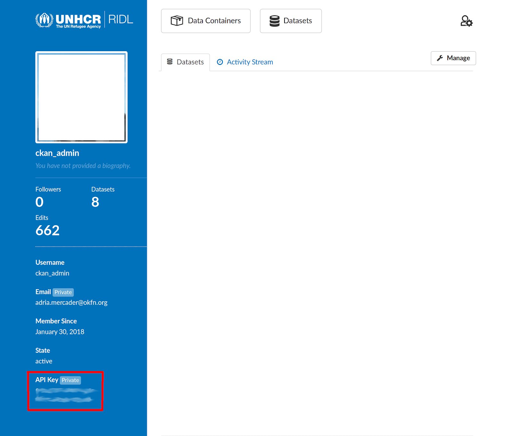

## UNHCR Raw Internal Data Library (RIDL)

The [UNHCR RIDL platform](https://ridl.unhcr.org) is UNHCR internal platform to easily store, find and analyze raw data.
This package is not on yet on CRAN and to install it, you will need the [`remotes`](https://github.com/r-lib/remotes) package.
You can get `ridl` from Gitlab or Github (mirror)

```{r, eval = FALSE}
## install.packages("remotes")
remotes::install_gitlab("dickoa/ridl")
```

### Setup the R package `ridl`

The `ridl` package requires you to add your API key and store it for further use. The easiest way to do that is to store your API key in your `.Renviron` file which is automatically read by R on startup.

You can retrieve your `API key` in your [user page](https://ridl.unhcr.org/user/).





### RIDL concepts

In order to easily use the `ridl` package, it's important to understand some key concepts of this platform. RIDL documentation is available [here](https://im.unhcr.org/ridl) for more details.

#### `Container`
A `container` is a placeholder where we can share data on `RIDL`.
A `container` is represented in the `ridl` package as a `RIDLContainer` object and can hold zero or multiple `datasets`.

Most functions are prefixed by `ridl_container` or `rc`

+ Get metadata of a resource: `ridl_container_show` or `rc_show`
+ Get the list of the names of all containers in the server: `ridl_container_list` or `rc_list`

#### `Dataset`
A `dataset` is a placeholder where we can share data files (`resources`). In a dataset page there's some metadata that give you enough context and information to properly store the data files and use them. A data file e.g an Excel file is called a `resource` and many of them can be shared in `dataset` page. In the `ridl` package, a `RIDLDataset` object is used to represent a `dataset`.

Most functions are prefixed by `ridl_dataset` or `rd`:

+ Get metadata of a dataset and its resources: `ridl_dataset_show` or `rd_show`
+ Get the list of the names of all datasets in the server: `ridl_dataset_list` or `rd_list`
+ Check whether a dataset exists or not: `ridl_dataset_exist` or `rd_exist`
+ Searches for datasets satisfying a given search criteria: `ridl_datasets_search` or `rd_search`

#### `Resource`
A `resource` is a file shared in `dataset` page, it includes `microdata` and supporting documents like reports or survey forms. A `RIDLResource` class is used to implement all the logic needed to manipulate RIDL `resource`.

Most functions are prefixed by `ridl_resource` or `rr`

+ Get metadata of a resource: `ridl_resource_show` or `rr_show`
